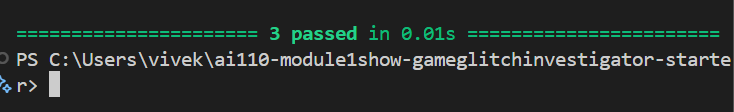
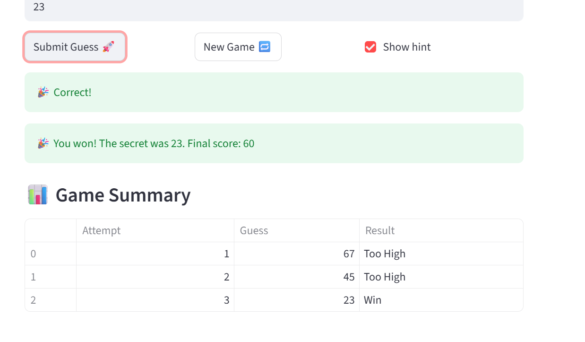
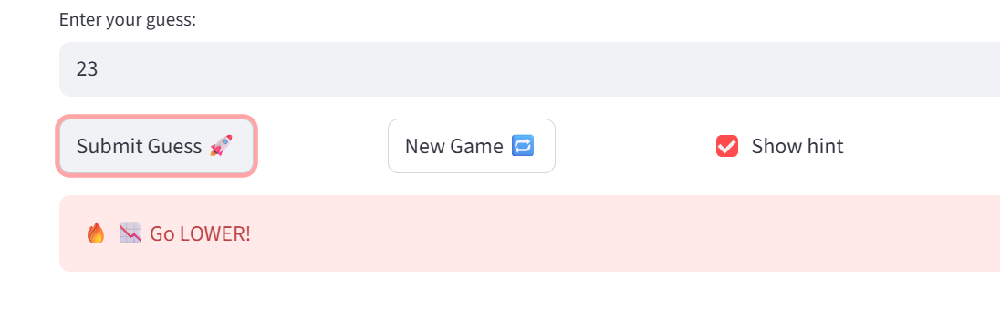

# 🎮 Game Glitch Investigator: The Impossible Guesser

## 🚨 The Situation

You asked an AI to build a simple "Number Guessing Game" using Streamlit.
It wrote the code, ran away, and now the game is unplayable. 

- You can't win.
- The hints lie to you.
- The secret number seems to have commitment issues.

## 🛠️ Setup

1. Install dependencies: `pip install -r requirements.txt`
2. Run the broken app: `python -m streamlit run app.py`

## 🕵️‍♂️ Your Mission

1. **Play the game.** Open the "Developer Debug Info" tab in the app to see the secret number. Try to win.
2. **Find the State Bug.** Why does the secret number change every time you click "Submit"? Ask ChatGPT: *"How do I keep a variable from resetting in Streamlit when I click a button?"*
3. **Fix the Logic.** The hints ("Higher/Lower") are wrong. Fix them.
4. **Refactor & Test.** - Move the logic into `logic_utils.py`.
   - Run `pytest` in your terminal.
   - Keep fixing until all tests pass!

## 📝 Document Your Experience

- Describe the game's purpose: The game is a number guessing game where players try to guess a secret number within a range based on difficulty level, receiving hints to go higher or lower, with scoring based on attempts.
- Detail which bugs you found: 1) Secret number always generated between 1-100 regardless of difficulty. 2) On even attempts, hints were wrong due to string comparison instead of numerical. 3) Attempt counter started at 1, showing incorrect attempts left. 4) Tests expected strings but functions returned tuples.
- Explain what fixes you applied: Refactored logic functions to logic_utils.py, fixed secret generation to use difficulty ranges, removed string conversion for consistent numerical comparison, set attempts to start at 0, updated test assertions to check tuple elements.

## 🧪 Test Results

All tests pass after fixing the logic bugs:

## 📸 Demo

Below are the key parts of the fixed game UI:

- The hint now correctly says **Go LOWER** when the guess is too high, and **Go HIGHER** when the guess is too low.
- The secret number stays stable across button clicks.
- The attempt counter correctly starts at the selected limit and decrements each guess.

> Take a screenshot of your terminal showing `3 passed` from `python -m pytest` (using Snipping Tool, Print Screen, etc.), save it into this project folder as `pytest_screenshot.png`, then re-open this README to confirm the image renders. If you don’t want to add an image file, you can leave the placeholder in place.

## 🚀 Stretch Features

- ✅ **Challenge 4 Completed**: Enhanced Game UI with color-coded hints (🔥 red for too high, ❄️ blue for too low), emojis, and a summary table showing attempt history.

*(Screenshot of the new player experience with colored hints and summary table)*

*(Additional screenshot showing the game summary table)*
